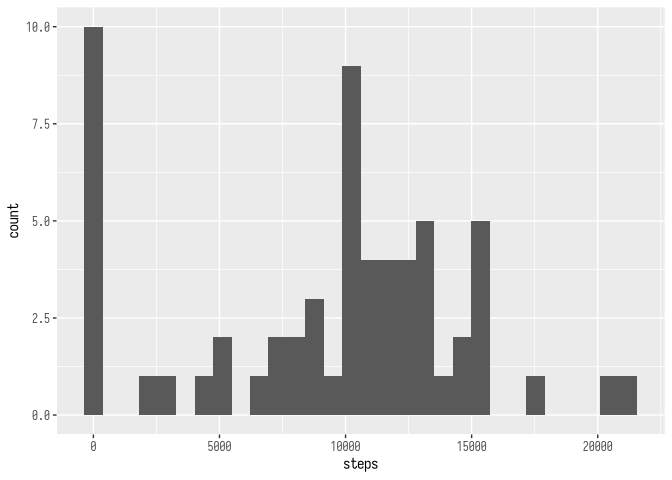
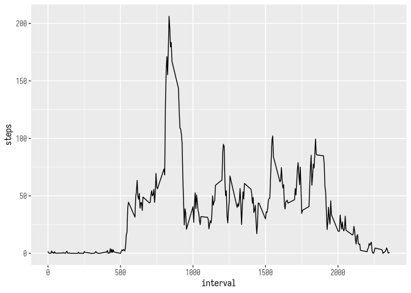
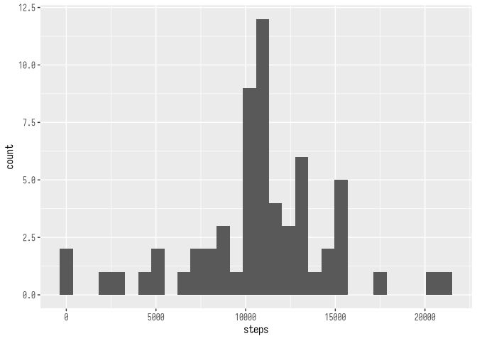
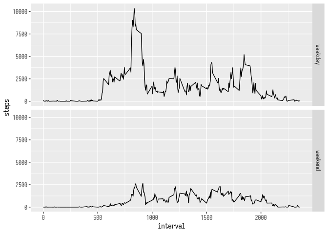

## Loading and preprocessing the data

Load the data using `readr` which supports reading from ZIP files and produces
a `tibble`.


``` r
library(readr)
activity <- read_csv("activity.zip")
```

```
## Rows: 17568 Columns: 3
## ── Column specification ────────────────────────────────────────────────────────
## Delimiter: ","
## dbl  (2): steps, interval
## date (1): date
## 
## ℹ Use `spec()` to retrieve the full column specification for this data.
## ℹ Specify the column types or set `show_col_types = FALSE` to quiet this message.
```


## What is mean total number of steps taken per day?


``` r
library(dplyr)
library(ggplot2)

activity_per_date <- activity %>%
  group_by(date) %>%
  summarise(steps = sum(steps, na.rm = TRUE))

ggplot(activity_per_date, aes(x = steps)) +
  geom_histogram()
```

<!-- -->

``` r
mean(activity_per_date$steps, na.rm = TRUE)
```

```
## [1] 9354.23
```

``` r
median(activity_per_date$steps, na.rm = TRUE)
```

```
## [1] 10395
```


## What is the average daily activity pattern?


``` r
activity_per_interval <- activity %>%
  group_by(interval) %>%
  summarise(steps = mean(steps, na.rm = TRUE))

ggplot(activity_per_interval, aes(x = interval, y = steps)) +
  geom_line()
```

<!-- -->

Interval with maximum number of steps:


``` r
activity_per_interval %>% { .[which.max(.$steps), ] }
```

```
## # A tibble: 1 × 2
##   interval steps
##      <dbl> <dbl>
## 1      835  206.
```


## Imputing missing values

Number of missing values:


``` r
activity %>% filter(is.na(steps)) %>% summarise(count = n())
```

```
## # A tibble: 1 × 1
##   count
##   <int>
## 1  2304
```

Impute missing values using the mean number of steps for that interval over
all days.


``` r
imputed <- inner_join(activity, activity_per_interval,
                      by = join_by(interval),
                      suffix = c("", "_mean"),
                      relationship = "many-to-one") %>%
  mutate(steps = if_else(is.na(steps), steps_mean, steps), .keep = "unused")

imputed_per_date <- imputed %>%
  group_by(date) %>%
  summarise(steps = sum(steps, na.rm = TRUE))
```

Histogram, mean, and median:

``` r
ggplot(imputed_per_date, aes(x = steps)) +
  geom_histogram()
```

```
## `stat_bin()` using `bins = 30`. Pick better value with `binwidth`.
```

<!-- -->

``` r
mean(imputed_per_date$steps, na.rm = TRUE)
```

```
## [1] 10766.19
```

``` r
median(imputed_per_date$steps, na.rm = TRUE)
```

```
## [1] 10766.19
```


## Are there differences in activity patterns between weekdays and weekends?


``` r
library(lubridate)
imputed %>% mutate(part_of_week = factor(
  case_match(
    wday(date, week_start = 1),
    1:5 ~ "weekday",
    6:7 ~ "weekend"),
  c("weekday", "weekend"))) %>%
  group_by(part_of_week, interval) %>%
  summarise(steps = sum(steps, na.rm = TRUE)) %>%
  { ggplot(., aes(x = interval, y = steps)) +
      geom_line() +
      facet_grid(rows = vars(part_of_week)) }
```

<!-- -->

Yes, weekdays have more steps and spikes of activities, perhaps related to
commute and work breaks.
